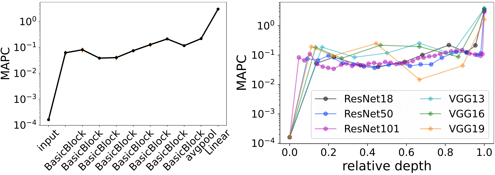
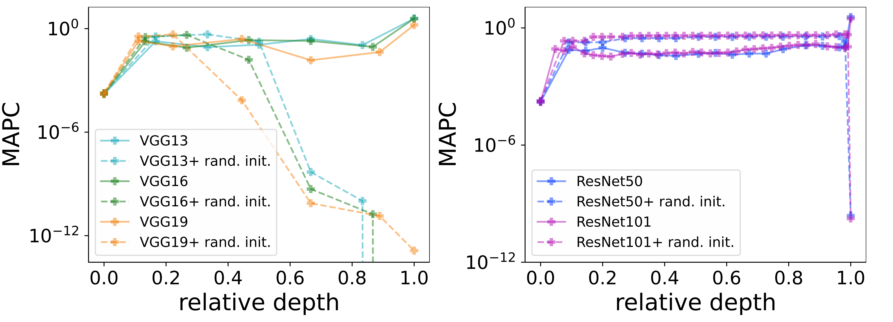
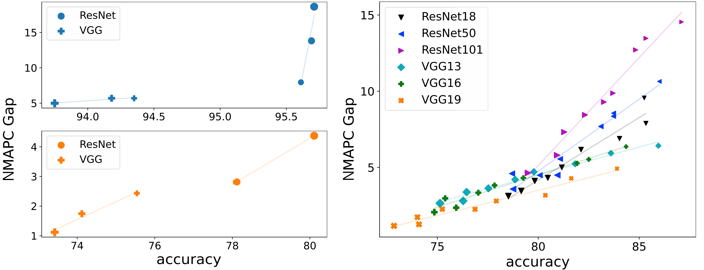

## Data Representations' Study of Latent Image Manifolds

## Overview
We investigate the curvature of image manifolds, i.e., the manifold deviation from being flat in its principal directions.

Our main results:
- State-of-the-art trained convolutional neural networks for image classification have a characteristic curvature profile along layers: an initial steep increase, followed by a long 
  phase of a plateau, and followed by another increase.
<div align=center></div>

- In contrast, this behavior does not appear in untrained networks in which the curvature flattens. 
<div align=center></div>

- The curvature gap between the last two layers has a strong  correlation with the generalization capability of the network.
  <div align=center></div>
  
## Training

In the repository, you can find a training script for the following models: ResNet18, ResNet50, ResNet101, VGG13, VGG16, VGG19. The models can be trained on CIFAR10 and CIFAR100.
To run the training process run the following command:
```
python train.py --model ResNet18 --dataset cifar10
```
You can train all the models by running the following shell code separately:

```
bash ./scripts/train_cifar10.sh
bash ./scripts/train_cifar100.sh
```

## Curvature evaluation
To estimate the intrinsic dimension, linear dimension, and curvature of the latent representations, execute the following command:
```
python est_curv.py --model_name ResNet18 --dataset cifar10
```


## Paper
```
@article{kafuman2023data,
  title={Data Representations' Study of Latent Image Manifolds},
  author={Kafuman, Ilya and Aznecot, Omri},
  journal={arXiv preprint arXiv:2305.19730},
  year={2023}
}
```
